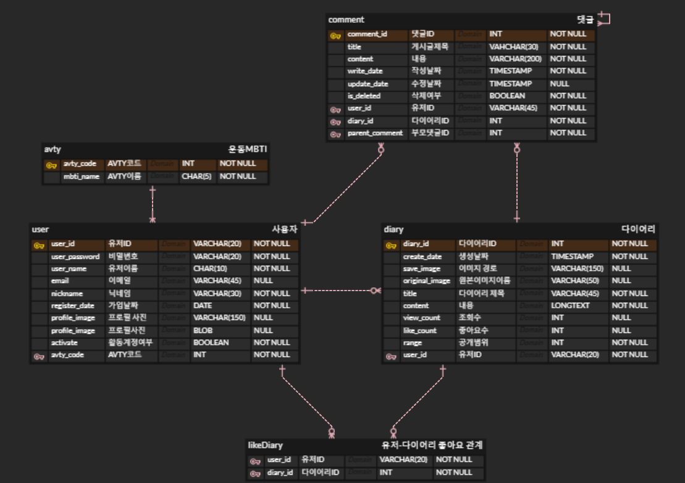
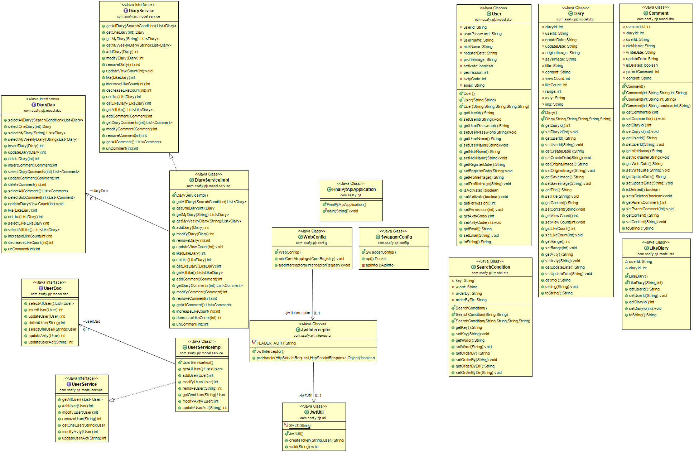
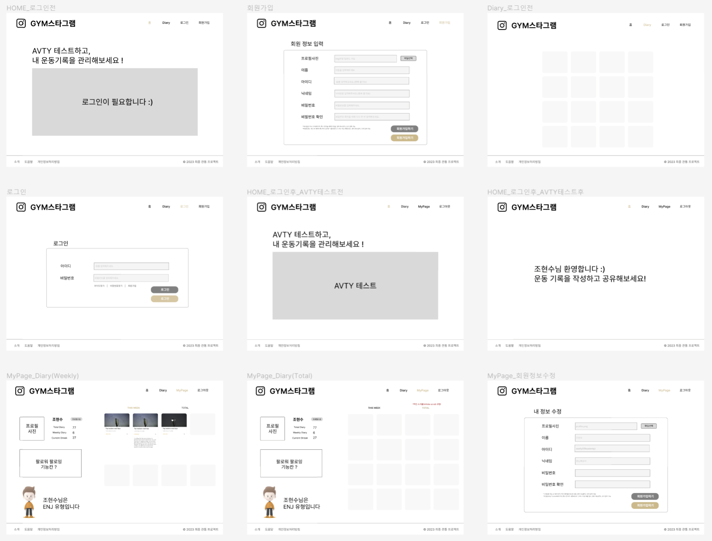
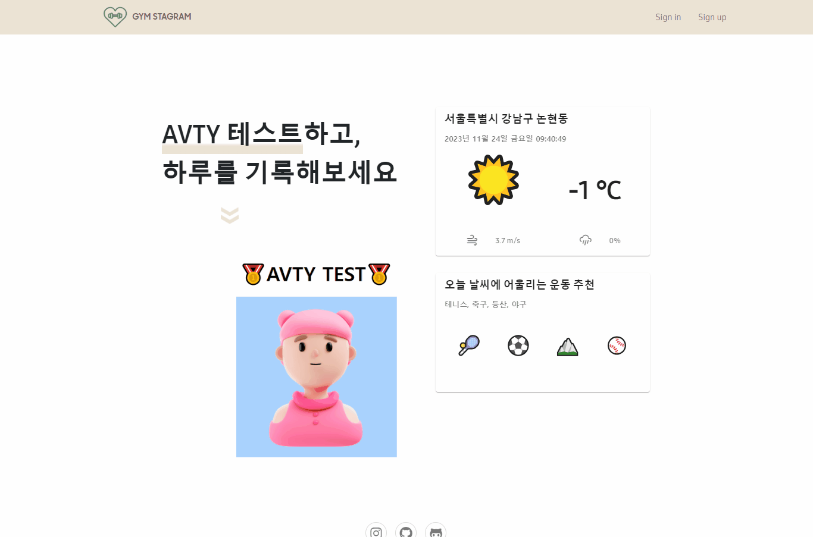
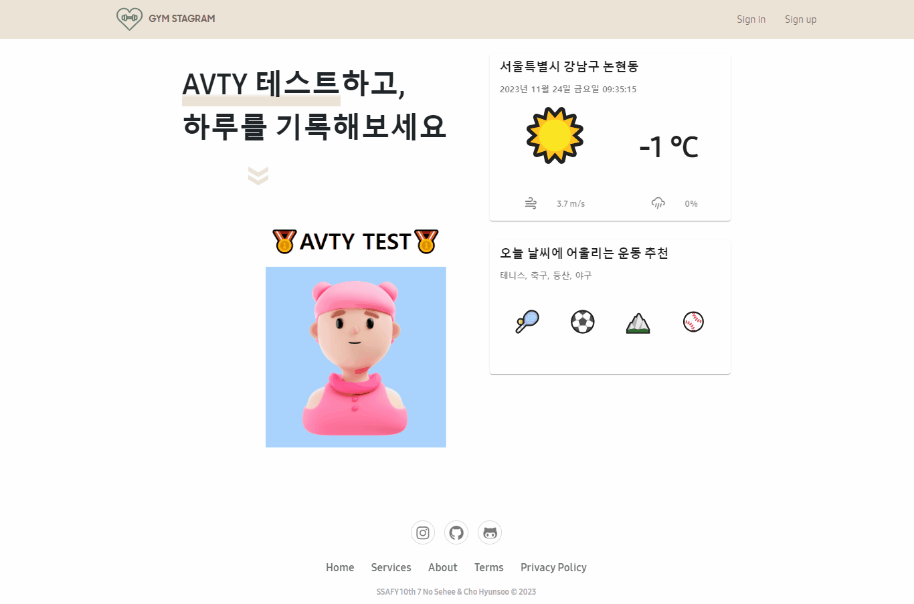
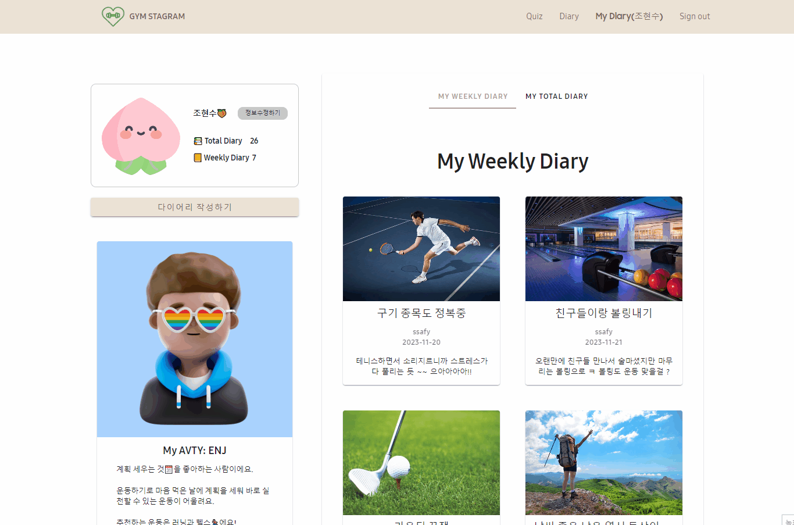
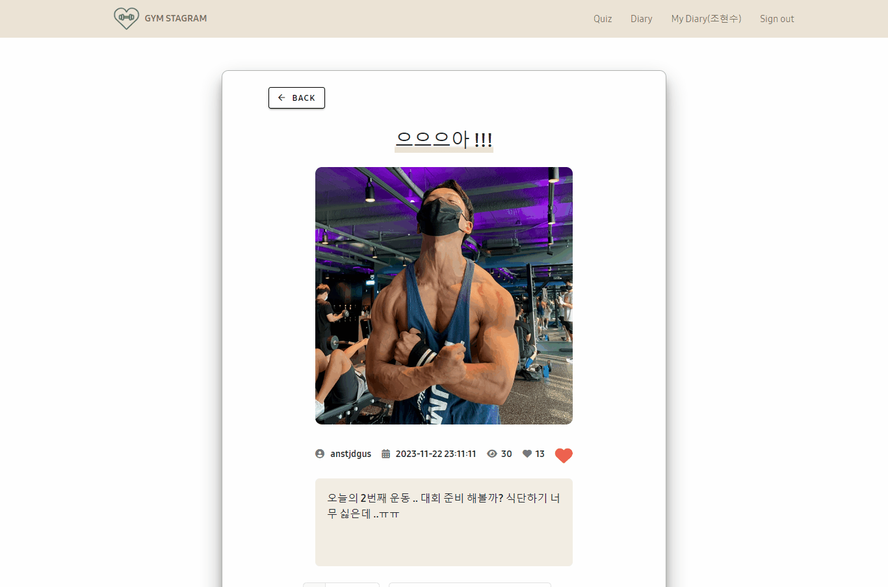

# ✨FINAL PROJECT✨

### SSAFY 10기 1학기 최종 관통 프로젝트

#### 주제: AVTY(운동 성향) 테스트와 운동 다이어리📒

<br/>

## 🤲🏻 팀원 구성 및 역할 분담 🤲🏻

<table align="center">
    <tr align="center">
        <td style="min-width: 250px;">
            <a href="https://github.com/hyunsoo10">
              
              <br />
              <b>조현수(팀장)</b>
            </a> 
        </td>
        <td style="min-width: 250px;">
            <a href="https://github.com/se2develop">
              
              <br />
              <b>노세희</b>
            </a>
        </td>
    </tr>
    <tr align="left">
        <td>
        0. 👨🏻‍💻Back-end / Front-end<br> 
        1. Dto / Dao / Controller / Service 구현 <br>
        2. Diary 등록 / 조회 / 수정 / 삭제 <br>
        3. DB 모델링 <br>
        4. 유튜브 API활용 음악 재생 기능 <br>
        5. 대댓글 작성 및 삭제된 댓글 기능  <br>
        6. Jwt 토큰 인증 방식 로그인 및 카카오 로그인 <br>
        7. 이미지 업로드 with Drag & Drop  <br>
        8. 사용자 비활성화 / 활성화 <br>
        9. 게시물 좋아요 기능 <br>
        10. 게시물 검색 조회 기능 <br>
        <br/>
        </td>
        <td>
        0. 👩🏻‍💻Front-end / Back-end<br>
        1. Mapper.xml 작성 <br>
        2. User 등록  / 조회 / 수정 / 삭제 <br>
        3. DB 모델링 <br>
        4. 날씨 API / 카카오맵 API 활용 날씨 카드 <br>
        5. AVTY 테스트 진행 및 결과 화면 <br>
        6. V- Calendar 활용한 Diary 조회<br>
        7. 유저 프로필 기능 및 화면 <br>
        8. DB 예시 데이터 작성 <br>
        <br/>
        </td>
    </tr>
</table>

<br/>
<br/>

<div align=left><h2>💻TECH STACKS</h2></div>

<div align=center> 
   
   
   
   
  <br>
   
   
   
  
  <br>


  
  
  
  <br>

  
  
</div>

##  🎯프로젝트 목표

###### 🔆 웹 아키텍처를 이해하고 이를 활용하여 웹 프로젝트를 설계하고 구현할 수 있다.
###### 🔆 SpringBoot와 Vue를 이해하고 활용할 수 있다.
###### 🔆 Rest API와 Vue Router를 활용하여 SPA 방식으로 프로젝트를 구성할 수 있다.
###### 🔆 기존 관통 프로젝트에 새로운 아이디어를 추가하여 과정에서 배운 기술들을 다양하게 구현해 본다.

<br/>
<br/>

# 설계서

## 📌 요구사항

- Spring Boot와 MyBatis 연동을 활용한 Rest API 서버 구현
- Vue3 버전을 활용한 SPA 클라이언트 구현

> ✅ : 구현 완료  ❌ : 미구현

#### 1️⃣ 기본기능 ✅

- 회원가입 / 회원탈퇴 ✅
- 로그인 / 로그아웃 ✅
- 다이어리 작성 / 조회 / 수정 / 삭제 ✅
- 댓글 작성 / 조회 / 수정 / 삭제 ✅
- AVTY 퀴즈 진행 및 결과 반영 ✅
- My Diary 페이지 ✅

#### 2️⃣ 추가기능 ✅

- Diary 좋아요 ✅
- Weekly Diary 조회 ✅
- 이미지 업로드 ✅
- Diary AVTY 기준 조회✅
- Youtube API 음악 재생 ✅
- Apex Charts로 AVTY 비율 차트 보여주기 ✅

#### 3️⃣ 심화기능
- 이미지 업로드 Drag & Drop ✅
- 카카오 로그인 ✅
- 대댓글 ✅
- 유저 계정 활성화 / 비활성화 ✅
-  v-calendar 로 diary 조회 ✅
- 기상청 API 와 Kakao Map API 활용한 날씨 카드 ✅


## 📌 유즈케이스 다이어그램

## 📌 테이블 구조도(ERD)


## 📌 클래스 다이어그램


## 📌 화면 설계서 (Figma)



# 🎬 프로젝트 OVERVIEW

#### 회원가입 (파일 Drag & Drop)


#### 로그인 / 로그아웃


#### 카카오로그인


#### AVTY 테스트


#### 회원 정보 수정(비활성화, 탈퇴)


#### 다이어리 작성


#### 다이어리 조회


#### 다이어리 수정


#### 다이어리 삭제


#### 댓글 작성, 수정, 삭제


#### 답글 작성, 수정, 삭제



<br>
<br>

# 소스코드 및 DB 스크립트

## 📌 백엔드

📂 **<u>폴더 구조</u>**
```
📂 FINAL_PJT_API
  ㄴ 📂 src\main\java
      ㄴ 📂 com\ssafy\pjt
          ㄴ 📄 FinalPjtApiApplication.java
          ㄴ 📂 config
              ㄴ 📄 SwaggerConfig.java
              ㄴ 📄 WebConfig.java
          ㄴ 📂 controller
              ㄴ 📄 DiaryRestController.java
              ㄴ 📄 UserRestController.java
          ㄴ 📂 interceptor
              ㄴ 📄 JwtInterceptor.java
          ㄴ 📂 model
              ㄴ 📂 dao
                  ㄴ 📄 DiaryDao.java
                  ㄴ 📄 UserDao.java
              ㄴ 📂 dto
                  ㄴ 📄 Comment.java
                  ㄴ 📄 Diary.java
                  ㄴ 📄 LikeDiary.java
                  ㄴ 📄 SearchCondition.java
                  ㄴ 📄 User.java
              ㄴ 📂 service
                  ㄴ 📄 DiaryService.java
                  ㄴ 📄 DiaryServiceImpl.java
                  ㄴ 📄 UserService.java
                  ㄴ 📄 UserServiceImpl.java
  ㄴ 📂 src\main\resources
      ㄴ 📂 mappers
          ㄴ 📄 diaryMapper.java
          ㄴ 📄 userMapper.java
      ㄴ 🍃 application.properties

```

### DiaryRestController

#### 1 - (1) 이미지 파일 업로드(MultipartFile Type으로 받기)
```java
	// diary 추가
	@PostMapping(value = "/diary", consumes = { MediaType.MULTIPART_FORM_DATA_VALUE })
	@ApiOperation(value = "새로운 diary추가")
	public ResponseEntity<?> insertOne(
			@RequestPart(required = false) @RequestParam(value = "image", required = false) MultipartFile file,
			@RequestPart("diary") Diary diary) {
		try {
			// 결과 값 담을 변수
			int result = 0;
			if (file != null && file.getSize() > 0) {
				String uploadPath = "C:\\FINAL\\PJT-FINAL-I-CHS-NSH\\ssafy_final_project\\src\\assets\\diary_image\\"
						+ diary.getUserId();
				String saveName = UUID.randomUUID() + "_" + diary.getOriginalImage();
				File target = new File(uploadPath, saveName);

				if (!new File(uploadPath).exists()) {
					new File(uploadPath).mkdirs();
				}

				try {
					FileCopyUtils.copy(file.getBytes(), target);
					diary.setSaveImage(saveName);
					result = diaryService.addDiary(diary);
				} catch (IOException e) {
					e.printStackTrace();
				}
			} else {
				// 파일이 없으면 그냥 업로드
				result = diaryService.addDiary(diary);
			}
			
			
			if (result > 0) {
				return new ResponseEntity<Diary>(diary, HttpStatus.OK);
			} else
				return new ResponseEntity<Void>(HttpStatus.BAD_REQUEST);
		} catch (Exception e) {
			return exceptionHandling(e);
		}
	}
```
#### 1 - (2) 이미지 파일 업로드(JSON 형식으로 받기)
```java
	//diary 추가 (이미지를 Base64로 인코딩해서 보낼 때)
	@PostMapping(value = "/diary")
	@ApiOperation(value = "새로운 diary추가")
	public ResponseEntity<?> insertOne(@RequestBody Diary diary){
		try {

			int result =  diaryService.addDiary(diary);
			if (result > 0) {
				return new ResponseEntity<Diary>(diary, HttpStatus.OK);
			} else
				return new ResponseEntity<Void>(HttpStatus.BAD_REQUEST);
		} catch (Exception e) {
			return exceptionHandling(e);
		}
	}
```
💡 Description <br>

다이어리에 이미지 파일을 업로드해서 파일을 저장/관리 하는 방법에 대한 고민을 많이 했습니다. 프론트엔드에서 백엔드로 데이터를 넘겨줄 때 주로 JSON 형태로 넘겨주고 백엔드에서는 이 데이터를 @RequestBody를 이용해서 적절한 객체로 데이터를 받아오는 방식이 일반적입니다. 하지만, 데이터에 이미지가 포함되어 있으면 일반적인 방법으로 전달이 불가능합니다. 따라서 저희는 2가지 방법을 고민했습니다. <br>

#### 1️⃣ JSON 데이터를 파일 형식으로 전환해서 데이터를 주고 받는다.

    프론트엔드쪽에서 var formData = new FormData() 객체를 활용해서 이미지파일을 담고,
    필요한 JSON 데이터도 BLOB형태로 변환해서 담아준 후에, 이를 백엔드 쪽에 보내면, 
    @RequestParam type으로 값을 받아서 활용할 수 있습니다. 이때 받은 이미지 파일은 
    지정한 경로에 저장해주고, 이때 저장한 이름을 DB에 저장한다면 프론트 엔드 쪽에서
    이 경로를 통해 이미지 파일에 접근해서 적절한 파일을 가져올 수 있습니다.
  


#### 2️⃣ 파일 데이터를 JSON 형식으로 전환해서 데이터를 주고 받는다.

    프론트엔드 쪽에서 이미지 파일을 Base64로 인코딩 하면 문자열로 바꿀 수 있습니다.
    이 문자열을 JSON에 담아서 백엔드로 보내면, @RequestBody로 JSON 데이터를 받을 수 있습니다.
    그리고 이 문자열을 DB에 그대로 저장해서(LONGTEXT) 나중에 이 문자열을 프론트엔드의
    src 경로에 불러오면 이미지 파일을 화면에 보여줄 수 있습니다.
    이 방식은 파일을 생성해서 업로드 하는 방식이 아니고, 이미지를 Base64 인코딩으로 문자열을 만들고
    나중에 화면에 해당 이미지를 다시 디코딩해서 보여주는 방식입니다.
    만약에 우리가 이미지를 따로 저장할 필요 없고, 한 데이터에 한 가지 이미지만 존재하며
    그 이미지가 자주 바뀌는 등의 행위가 일어난다면 이 방식을 통해 이미지를 저장하고 활용하는 방법도 유용할 것 같습니다.
<hr>
<br>

### 2. Diary 좋아요 / 좋아요 해제

```java
	// diary 좋아요
	@PostMapping("diary/like")
	@ApiOperation(value = "diary 좋아요")
	public ResponseEntity<?> likeDiary(@RequestBody LikeDiary likeDiary) {
		try {
			int result = diaryService.like(likeDiary);
			int result1 = diaryService.increaseLikeCount(likeDiary.getDiaryId());
			if (result > 0 && result1 > 0) {
				System.out.println(likeDiary.getDiaryId());
				return new ResponseEntity<String>("좋아요 성공", HttpStatus.OK);
			} else
				return new ResponseEntity<Void>(HttpStatus.BAD_REQUEST);
		} catch (Exception e) {
			return exceptionHandling(e);
		}

	}

	// diary 좋아요 해제
	@DeleteMapping("diary/like")
	@ApiOperation(value = "diary 좋아요 해제")
	public ResponseEntity<?> unLikeDiary(@RequestBody LikeDiary likeDiary) {
		try {
			int result = diaryService.unLike(likeDiary);
			int result1 = diaryService.decreaseLikeCount(likeDiary.getDiaryId());
			if (result > 0 && result1 > 0) {
				return new ResponseEntity<String>("좋아요 해제", HttpStatus.OK);
			} else
				return new ResponseEntity<Void>(HttpStatus.NO_CONTENT);
		} catch (Exception e) {
			return exceptionHandling(e);
		}

	}
```

💡 Description <br>

다이어리 좋아요 요청이 들어오면 likeDiary 테이블에 userId와 diaryId를 매핑 시킨 likeDiary Dto를 넘겨줍니다. 그리고 동시에 해당 diaryId의 좋아요 숫자를 증가시켜줍니다.

다이어리 좋아요 해제 요청이 들어오면 likeDiary Dto를 넘겨줘서 해당하는 값을 likeDiary에서 삭제해줍니다. 그리고 동시에 해당 diaryId의 좋아요 숫자를 감소시켜줍니다.
<hr>
<br>

### 3. User의 Diary 좋아요 여부 체크 
``` java

	// diaryId와 userId 로 다이어리 좋아요 여부 체크
	@GetMapping("diary/like/{userId}/{diaryId}")
	@ApiOperation(value = "diary좋아요 여부 확인 diaryId와 userId와 일치하는 목록 있는지 체크")
	public ResponseEntity<?> likeList(@PathVariable(value = "userId") String userId,
			@PathVariable(value = "diaryId") int diaryId) {
		try {
			LikeDiary likeDiary = new LikeDiary();

			likeDiary.setUserId(userId);
			likeDiary.setDiaryId(diaryId);
			int result = diaryService.getLikeDiary(likeDiary);
			if (result == 1) {
				return new ResponseEntity<Integer>(1, HttpStatus.OK);
			} else
				return new ResponseEntity<Void>(HttpStatus.NO_CONTENT);
		} catch (Exception e) {
			return exceptionHandling(e);
		}

	}

```
💡 Description <br>
User가 특정 Diary에 좋아요를 눌렀는지 않았는지를 확인해서 응답을 해주는 API 메서드입니다. 파라미터로 userId 와 diaryId를 전달 받고, DB의 likeDiary 테이블에서 두 값과 일치하는 값이 있으면 해당 user는 해당 diary를 이미 좋아요 누른 상태이고, 일치하는 값이 없으면 아직 누르지 않은 상태입니다.
<hr>
<br>

### 4. 댓글 비활성화

```java
	// 댓글 비활성화
	@PutMapping("/diary/uncomment/{commentId}")
	@ApiOperation(value = "{commentId} 댓글 비활성화")
	public ResponseEntity<String> unComment(@PathVariable int commentId) {
		try {
			int result = diaryService.unComment(commentId);
			if(result > 0) {
				return new ResponseEntity<String>("댓글이 비활성화 됐습니다.", HttpStatus.OK);
			}
			return new ResponseEntity<String>("댓글 상태 변경에 실패했습니다.", HttpStatus.NOT_MODIFIED);
		} catch (Exception e) {
			return exceptionHandling(e);
		}
	}
```
💡 Description <br>
특정 댓글에 하위 댓글이 업을 경우 DB에서 그냥 삭제를 하게 됩니다. 하지만, 하위 댓글이 있을 경우에 해당 댓글을 DB에서 지우지 않고, isDeleted 컬럼에 값을 true로 변경시켜서 비활성화 시킵니다. 이는 해당 댓글이 삭제 되면 그 댓글에 달린 다른 하위 댓글들도 사라지게 되는 문제를 방지하기 위함입니다. isDeleted가 true인 경우 프론트엔드에서 내용을 보여주지 않고, "삭제된 댓글입니다" 라는 문구를 대신 보여줍니다.

<hr>
<br>


### UserRestController

#### 1 Jwt 로그인

```java
	@PostMapping("/user/jwtlogin")
	@ApiOperation(value = "로그인 with Jwt 토큰인증")
	public ResponseEntity<Map<String, Object>> login(@RequestBody User user) {
		Map<String, Object> result = new HashMap<String, Object>();
		System.out.println("백앤드로 넘어오는 유저 정보 : " + user);
		HttpStatus status = null;
		try {
			//로그인 시도 user 객체의 ID와 비밀번호에 해당하는 user정보가 있는지 DB에서 검사
			String userId = user.getUserId();
			String password = user.getUserPassword();

			User dbUser = userService.getOneUser(userId);
			
			
			//아이디가 있다면
			if(dbUser != null) {
				//비밀번호까지 일치한다면
				if (dbUser.getUserPassword().equals(password)) {
					//나머지 필요한 정보 담아주기
					user.setAvtyCode(dbUser.getAvtyCode());
					user.setNickName(dbUser.getNickName());
					user.setProfileImage(dbUser.getProfileImage());
					user.setRegisterDate(dbUser.getRegisterDate());
					user.setUserName(dbUser.getUserName());
					user.setActivate(dbUser.isActivate());
					user.setEmail(user.getEmail());
					//세션 스토리지에 유저의 비밀번호를 저장하고 싶지 않을 때 임의로 set해서 프론트쪽에 보낼 수 있다
					//user.setUserPassword("TOP-SECRET");
					user.setUserPassword(dbUser.getUserPassword());
					System.out.println("프론트로 넘길 유저 정보 : " +user);
					
					result.put("access-token", jwtUtil.createToken("user", user));
					
					result.put("message", SUCCESS);
					status = HttpStatus.ACCEPTED;
				}else {
					//아이디는 맞았지만 비밀번호가 틀렸다면
					result.put("message", WRONGPASSWORD);
					status = HttpStatus.OK;
				}
			}
			else {
				//해당하는 ID를 찾을 수 없다면
				result.put("message", NOFOUNDID);
				status = HttpStatus.OK;
			}
		} catch (UnsupportedEncodingException e) {
			result.put("message", FAIL);
			status = HttpStatus.INTERNAL_SERVER_ERROR;
		}
		
		return new ResponseEntity<Map<String,Object>>(result, status);
	}
```
💡 Description <br>
Jwt 토큰 인증 방식으로 access토큰을 발급받고, 프론트 엔드에 해당 토큰 정보를 넘겨줘서 로그인을 진행하는 API 메서드 입니다. 프론트엔드에서 넘겨 받은 userId와 userPassword 데이터와 일치하는 유저가 있을 경우 access-token과 함께 user 정보를 프론트엔드에 넘겨줍니다.

처음에는 userPassword 데이터를 "TOP-SECRET" 으로 숨겨서 프론트엔드로 보내주었습니다. 하지만, 회원 탈퇴 / 계정 비활성화 작업시에 프론트엔드에서 userPassword가 필요한 상황이 생겨서 userPassword 데이터도 같이 넘겨주는 방식으로 바꿨습니다. 물론, 회원 탈퇴 / 계정 비활성화 작업시에도 axios 요청을 보내서 valid 여부를 확인해도 가능하지만, 요청 없이 즉각적으로 확인하기 위해서 프론트엔드 부분에서 password valid 여부를 확인 할수 있도록 작업했습니다.

<hr>
<br>

#### 2 User avty 코드 수정

```java
	@PutMapping(value = "/user/{userId}")
	@ApiOperation(value = "avty코드 수정", response = Integer.class) 
	public ResponseEntity<?> updateAvty(@RequestBody User user) {
		int result = userService.modifyAvty(user);
		
		if (result > 0) {
			return new ResponseEntity<User>(user, HttpStatus.OK);
		} else
			return new ResponseEntity<Void>(HttpStatus.BAD_REQUEST);
	}
```

💡 Description <br>
User의 avty 테스트가 끝나면, 해당 결과를 프론트에서 받아온 다음에 DB에 결과 값으로 나온 avty 코드를 삽입해주는 API 메서드 입니다. user의 전체 정보 수정 API 메서드가 있긴 하지만, avty 컬럼 정보만 업데이트 해주는 작업에 user 전체 정보 수정 API 메서드를 활용하는 것이 비효율적이라고 생각했기 때문에 따로 메서드를 구현했습니다.

<hr>
<br>

#### 3 User 계정 활성화 / 비활성화

```java
	// 회원 비활성화 / 활성화
	@PutMapping("/user/activate/{userId}")
	@ApiOperation(value = "{userId} 회원 활성화 상태 변화")
	public ResponseEntity<String> changeActivate(@PathVariable String userId) {
		try {
			int result = userService.updateUserAct(userId);
			if(result > 0) {
				User user = (User) userService.getOneUser(userId);
				if(user.isActivate())
					return new ResponseEntity<String>("계정이 활성화 되었습니다.", HttpStatus.OK);
				else
					return new ResponseEntity<String>("계정이 비활성화 되었습니다.", HttpStatus.OK);
				
			}
			return new ResponseEntity<String>("계정 상태 변경에 실패했습니다.", HttpStatus.NOT_MODIFIED);
		} catch (Exception e) {
			return exceptionHandling(e);
		}
	}
```
💡 Description <br>
회원 탈퇴가 고민된다면 계정을 비활성화 시킬 수 있는 옵션을 제공해주는데, 이때 회원 계정을 비활성화 시키고 다시 활성화 시킬때 활용하는 API 메서드입니다. user 테이블의 activate 컬럼이 true이면 활성화 계정, false이면 비활성화 계정입니다.

파라미터로 전달받은 userId에 해당하는 user의 activate 컬럼을 반대 값( activate = !activate)으로 전환시켜주는 로직을 통해, 활성화와 비활성화 작업을 동일한 메서드에서 진행할 수 있도록 했습니다.

<hr>
<br>

### Mapper

#### 1. diaryMapper.xml

**다이어리 조회**
```xml
	<!-- 전체 다이어리 조회 -->
	<select id="selectAllDiary" parameterType="SearchCondition" resultType="Diary">
		SELECT diary.diary_id AS diaryId, diary.user_id as userId, diary.title AS title, diary.content AS content, diary.range AS `range`, create_date AS createDate, original_image AS originalImage,
			   save_image AS saveImage, view_count AS viewCount, like_count AS likeCount, avty.avty_name AS avty
		 FROM diary
			INNER JOIN user ON diary.user_id = user.user_id
   			INNER JOIN avty ON user.avty_code = avty.avty_code
		<if test="key!='none'">
			WHERE ${key} LIKE CONCAT('%' #{word} '%')
		</if>
		<if test="orderBy!='none'">
			ORDER BY ${orderBy} ${orderByDir}
		</if>
		<if test="orderBy =='none'">
			ORDER BY diary.create_date DESC
		</if>
	</select>

```
💡 Description <br>
diary 테이블에서 데이터를 가져올 때 user 테이블과 avty테이블에서도 받아와야 하는 정보가 있기 때문에 INNER JOIN 을 활용해서 필요한 정보를 모두 받아오도록 했습니다. SearchCondition dto를 파라미터로 넘겨줘서 검색 조건에 따라 값을 조회할 수 있게 동적쿼리를 활용했습니다.

<hr>
<br>
<br>
<br>

**weekly diary**
```xml
	<!-- weekly 다이어리 조회 -->
	<select id="selectMyWeeklyDiary" parameterType="String" resultMap="diaryMap">
		SELECT * 
		FROM diary
		WHERE diary.create_date BETWEEN ADDDATE( CURDATE(), - WEEKDAY(CURDATE()) + 0 ) AND ADDDATE( CURDATE(), - WEEKDAY(CURDATE()) + 6 )
	    AND user_id = #{userId}
	    GROUP BY create_date
	    ORDER BY create_date ASC;
	</select>

```
💡 Description <br>
user의 weekly diary를 조회해서 가져오는 쿼리문 입니다. WHERE 조건절에 
```WHERE diary.create_date BETWEEN ADDDATE( CURDATE(), - WEEKDAY(CURDATE()) + 0 ) AND ADDDATE( CURDATE(), - WEEKDAY(CURDATE()) + 6 )``` 이렇게 조건을 주고 쿼리를 날리면 현재 날짜 기준으로 create_date가 월화수목금토일 사이에 있는 데이터 들만 조회할 수 있습니다. 

<hr>
<br>
<br>
<br>

**diary 좋아요**
```xml
	<!-- 다이어리 좋아요 -->
	<insert id="like" parameterType="LikeDiary">
			INSERT INTO likediary (user_id, diary_id)
			VALUES (#{userId}, #{diaryId})
	</insert>
	<!-- 다이어리 좋아요 해제 -->
	<delete id="unLike" parameterType="LikeDiary">
			DELETE 
			FROM likediary
			WHERE user_id = #{userId} AND diary_id = #{diaryId}
	</delete>

```
💡 Description <br>
좋아요 - likeDiary dto의 userId와 diaryId의 조합이 likediary에 추가

좋아요 해제 - likeDiary dto의 userId와 diaryId의 조합이 likediary에서 삭제

<hr>
<br>
<br>
<br>

**대댓글**
```xml
	<!-- 대댓글 조회 -->
	<select id="selectSubComment" resultMap="commentMap">
		SELECT * 
			FROM comment
			WHERE parent_comment = #{commentId}
	</select>
	
		<!-- 댓글 비활성화 -->
	<update id="unComment" parameterType="int">
		UPDATE comment
			SET is_deleted = NOT is_deleted
			WHERE comment_id = #{commentId}
	</update>
```
💡 Description <br>
comment의 parent_comment에 0이 아닌 값이 있다면 해당 comment는 하위 댓글이라는 것을 의미합니다. parent_comment에는 해당 댓글의 부모 댓글의 comment_id가 담겨 있습니다. 따라서 parent_comment = commentId 조건으로 값을 조회하면 commentId의 대댓글을 조회할 수 있습니다.

대댓글이 달린 댓글의 경우 DB에서 삭제하는 것이 아니라 is_deleted를 true로 변경시켜서 삭제된 댓글임을 표시만하고 DB에 값을 유지하게 됩니다. is_deleted는 false가 default값입니다. 해당 댓글의 하위 댓글이 있는지 없는지의 여부는 프론트엔드에서 확인하고 백엔드로 유효한 요쳥을 날리는 방식으로 동작합니다.

<hr>
<br>
<br>
<br>

#### 2.  userMapper.xml

```xml
	<!-- 회원 탈퇴 -->
	<delete id="deleteUser" parameterType="String">
		DELETE FROM user
			WHERE user_id = #{userId}
	</delete>
	
	<!-- 유저 활성화/비활성화 -->
	<update id="updateUserAct" parameterType="String">
		UPDATE user
			SET activate = NOT activate
			WHERE user_id = #{userId}
	</update>

```
💡 Description <br>
회원 탈퇴시에는 DB에서 정보를 지워버리고, 비활성화 시켰을 때는 activate를 false로 전환시켜줍니다. activate의 기본값은 true입니다. 또한 비활성화된 계정의 경우는 activate를 다시 true로 전환시켜서 활성화시켜줍니다.
<hr>
<br>


## 📌 프론트

📂 **<u>폴더 구조</u>**


```
📂 ssafy_final_project
    ㄴ 📂 node_modules
    ㄴ 📂 public
    ㄴ 📂 src
        ㄴ 📂 assets
        ㄴ 📂 components
            ㄴ 📂 avty
                ㄴ 📄 TheAVTYChart.vue
            ㄴ 📂 common
                ㄴ 📄 TheFooter.vue
                ㄴ 📄 TheHeaderNav.vue
            ㄴ 📂 diary
                ㄴ 📂 comment
                    ㄴ 📄 Comment.vue
                ㄴ 📂 mydiary
                    ㄴ 📄 AVTY.vue
                    ㄴ 📄 MyDiary.vue
                    ㄴ 📄 MyWeeklyDiary.vue
                    ㄴ 📄 Profile.vue
                ㄴ 📄 DiaryCreate.vue
                ㄴ 📄 DiaryList.vue
                ㄴ 📄 DiaryUpdate.vue
            ㄴ 📂 kakao
                ㄴ 📄 KakaoLoginCheck.vue
            ㄴ 📂 weather
                ㄴ 📄 WeatherForecast.vue
            ㄴ 📂 youtube
                ㄴ 📄 YoutubeMusicPlayer.vue
        ㄴ 📂 router
                ㄴ 📄 index.js
        ㄴ 📂 stores
            ㄴ 📄 diary.js
            ㄴ 📄 user.js
            ㄴ 📄 youtube.js
        ㄴ 📂 views
            ㄴ 📂 diary
                ㄴ 📄 DiaryDetailView.vue
                ㄴ 📄 DiaryView.vue
                ㄴ 📄 MyPageView.vue
            ㄴ 📂 user
                ㄴ 📄 KakaoLoginView.vue
                ㄴ 📄 LoginView.vue
                ㄴ 📄 QuizView.vue
                ㄴ 📄 SignupView.vue
                ㄴ 📄 UpdateView.vue
            ㄴ 📄 HomeView.vue
        ㄴ 📄 App.vue
        ㄴ 📄 main.js
    ㄴ 📄 .env.local
    ㄴ 📄 index.html
    ㄴ 📄 package-lock.json
    ㄴ 📄 package.json
    ㄴ 📄 vite.config.js


```


### 카카오 로그인

#### 1. 접근 코드 받기 (LoginView.vue)
```js
const KAKAO_API_KEY = import.meta.env.VITE_KAKAO_API_KEY;

// 카카오 로그인
const kakaoLogin = () => {
    const redirect_uri = 'http://localhost:5173/kakaoLogin';
    const cliendId = KAKAO_API_KEY;
    const AuthURL = `https://kauth.kakao.com/oauth/authorize?response_type=code&client_id=${cliendId}&redirect_uri=${redirect_uri}&'scope=account_email profile_nickname'`
    window.location.href = AuthURL;

}
```
💡 Description <br>

`https://kauth.kakao.com/oauth` 에 적절한 파라미터와 함께 요청을 날려서(kakao dev api 키를 활용), 내가 설정한 redirect_uri에서 쿼리 스트링으로 code라는 값에 access-token을 전달 받는다.

<hr>
<br>

#### 2. access-token받고 토큰으로 유저 정보 받기 (KakaoLoginCheck.vue)
```js

onMounted(()=>{
    code.value = route
    kakaoGetToken(code.value)
    userStore.getUserList()
    
})

const kakaoGetToken = () =>{
import {useRoute} from 'vue-router'
import axios from 'axios'
import { useUserStore } from '@/stores/user'

//인가코드 쿼리로 받아오기
//파라미터가 아니라 쿼리스트링으로 받아오는 것임
const route = useRoute().query.code

    axios({
        url: 'https://kauth.kakao.com/oauth/token',
        method: 'POST',
        data:{
            grant_type: "authorization_code",
            client_id: "01bdd0d43fb0ea7f402dc99e9f0f02d4",
            redirect_uri: "http://localhost:5173/kakaoLogin",
            code: code.value
        },
        headers: {
            'Content-type': 'application/x-www-form-urlencoded;charset=utf-8'
        }
    })
    .then((res)=>{
        console.log(res.data)
        accessToken.value = res.data['access_token']
        //유저 정보 받아오기
        kakaoGetUserInfo()
    })
}

const kakaoGetUserInfo = () =>{
    axios({
        url: 'https://kapi.kakao.com/v2/user/me',
        method: 'GET',
        headers: {
            'Authorization' : `Bearer ${accessToken.value}`
        }
    })
    .then((res)=>{
        kakaoInfo.value.email = res.data["kakao_account"]["email"]
        kakaoInfo.value.nickName = res.data["kakao_account"]["profile"].nickname
    })
    .then(()=>{
        //DB의 전체 유저 리스트에서 카카오 로그인 시도 이메일과 같은 이메일이 있다면 로그인 해주기
        let kakao = userStore.users.find((user) => user.email === kakaoInfo.value.email)
        //카카오로 회원가입 했던 유저는 로그인 시켜주기
        if(kakao != undefined){
            let kakaoUser = {
                userId : kakao.userId,
                userPassword: kakao.userPassword
            }
            userStore.login(kakaoUser)
            return
        }
    })
}

```
💡 Description <br>

카카오에서 응답받은 code를 `useRoute().query.code`로 받아와야 합니다. 이때 주의할 점은 파라미터가 아니라 쿼리스트링으로 값이 넘어오기 때문에 `route.params.code`로 받는 것이 아니라는 것을 주의해야 합니다. 이렇게 요청 받은 코드를 다른 적절한 data와 함께 `https://kauth.kakao.com/oauth/token`로 요청을 날리면, 카카오로 부터 access-token을 응답받을 수 있습니다.

이렇게 access-token을 응답 받았으면, 이제 유저 정보를 받아와야 합니다. `https://kapi.kakao.com/v2/user/me`에 headers ``` 'Authorization' : `Bearer ${accessToken.value}` ``` 정보를 포함시켜서 적절한 요청을 날리면 user가 동의한 항목에 대한 정보를 응답받을 수 있습니다. 하지만 저희 사이트에서 더 필요한 정보가 있기 때문에, 첫 로그인 시도시에는 추가 정보를 입력받아서 저희 사이트에 회원가입을 하는 방식으로 로직을 구현했습니다.

이렇게 카카오 로그인을 통해 회원가입한 유저 DB에는 email에 카카오 로그인 email 정보가 담깁니다. 이 email 정보는 다음에 해당 유저가 카카오 로그인을 시도할 때 바로 로그인할 수 있게 해주는 방식으로 활용했습니다.
<hr>
<br>
<br>
<br>

### 회원가입

#### 1. 유효성 검사

```js
const regist = function (event) {
    // 유효성 검사
    // 1. 비밀번호 입력과 비밀번호 확인 입력의 일치 여부
    if (user.value.userPassword != password2.value) {
        alert('비밀번호가 일치하지 않습니다.').
            return;
    }
    // 2. 비밀번호가 8자리 이상, 16자 이하이며 특수문자(!@#$%^&*)
    const pattern = /[!@#$%^&*]/
    if (user.value.userPassword.length < 8 || user.value.userPassword.length > 16 || !pattern.test(user.value.userPassword)) {
        alert('비밀번호는 8자리 이상, 16자리 이하이며, 특수문자(!@#$%^&*)를 포함해야 합니다.')
        return
    }

    // 3. 이미 등록된 ID, 닉네임인지 중복 여부 확인
    axios.get("http://localhost:8080/user-api/user")
    .then((res) => {
        checkId.value = res.data.find(
            (u) => u.userId === user.value.userId
        );
        nickNameCheck.value = res.data.find(
            (u) => u.nickName === user.value.nickName
        );
    })
    .then(() => {

        if (checkId.value) {
            alert('이미 존재하는 ID입니다.');
            return
        }
        if (nickNameCheck.value) {
            alert('이미 존재하는 닉네임입니다.');
            return
        }
        signup()
    })

    const signup = () => {

        //회원 가입 로직 생략
    }

};

```
💡 Description <br>
- 비밀번호 일치 확인 검사
- 비밀번호 8자리 이상, 16자리 이하, 특수문자 포함 검사
- 중복 ID 와 nickname 검사

<hr>
<br>

#### 2. 랜덤 닉네임 추천
```js
const randomNickName = ref('')

//랜덤 닉네임 불러오기
onMounted(() => {
    axios({
        //cors에러 해결하기 위해서 임시로 인증받고 처리
        url: `https://cors-anywhere.herokuapp.com/https://nickname.hwanmoo.kr?format=json`,
        method: 'GET',
        headers: {
            'Access-Control-Allow-Origin': '*'
        }
    })
    .then((response) => {
        // console.log(response['data'].words[0])
        randomNickName.value = response['data'].words[0]
        user.nickName = randomNickName.value
        // console.log(user.nickName)
    })
    .catch((error) => {
        console.log(error)
    })

})

```
💡 Description <br>
랜덤 단어를 json 형식으로 응답받을 수 있는 `https://nickname.hwanmoo.kr?format=json`가 있는데, 여기서 응답 받아온 랜덤 단어를 회원 가입시에 추천 닉네임으로 제공해줄 수 있습니다. 하지만 이때 CORS 에러가 발생해서 `https://cors-anywhere.herokuapp.com` 라는 cross-origin 요청을 임시로 가능하게 해주는 API가 있어서, 이를 활용해서 CORS에러를 임시적으로 해결해서 랜덤 닉네임을 받아왔습니다.

<hr>
<br>
<br>
<br>

### AVTY 퀴즈

#### 1. 퀴즈 진행 및 결과
```js
// 1. 메인 페이지에서 질문 페이지로 넘어가기
const begin = function () {
    setTimeout(() => {
        styleObjMain.value['display'] = 'none';
        styleObjStatusBar.value['display'] = 'block';
        styleQbox.value['display'] = 'block';
        styleObjQna.value['display'] = 'block';
    }, 200)

    // 질문 나오게 하는 goNext() 호출
    let qIdx = 0;
    goNext(qIdx);
}

// 2. 질문 페이지의 첫 번째 질문과 응답 나오게 하기
function goNext(qIdx) {
    // 마지막 질문이면 결과 나오게하는 goResult() 호출하고 return
    if (qIdx === endPoint) {
        goResult();
        return;
    }

    let qBox = document.querySelector('.qBox');
    // `qnaList`의 qIdx번째 인덱스의 `q`가 들어오도록
    qBox.innerHTML = qnaList[qIdx].q;

    // `qnaList`의 qIdx번째 인덱스의 `a` 배열 i번 반복(선택지)
    for (let i in qnaList[qIdx].a) {
        // addAnswer()에 `qnaList`의 qIdx번째 인덱스의 `a` 배열의 i번째 인덱스의 answer와 qIdx를 인자로 전달
        addAnswer(qnaList[qIdx].a[i].answer, qIdx, i);
    }

    // 진행상태 보여주는 var
    let status = document.querySelector('.statusBar');
    styleObjStatusBar.value['width'] = (100 / endPoint) * (qIdx + 1) + '%';
}

// 3. 9개의 질문에 대한 답 선택하고 -> 다음 질문으로 넘어가기
function addAnswer(answerText, qIdx, idx) {

    // 응답 전체를 담는 박스
    let answerBox = document.querySelector('.answerBox');

    // 2가지 응답버튼
    let answer = document.createElement('button');
    answer.classList.add('answerList');

    // 응답 전체 박스에 개별 응답버튼 넣기
    answerBox.appendChild(answer);
    // 개별 응답 버튼에 파라미터로 받은 answerText(=qnaList[qIndx].a[i].answer) 넣기
    answer.innerHTML = answerText;

    // 버튼 클릭할 때마다 발생하는 이벤트 적용
    answer.addEventListener("click", function () {
        // 모든 응답버튼 children에 담기
        let children = document.querySelectorAll('.answerList');

        // 모든 응답버튼 반복
        for (let i = 0; i < children.length; i++) {
            // 모든 응답버튼 비활성화
            children[i].disabled = true;
        }

        setTimeout(() => {
            var target = qnaList[qIdx].a[idx].type;
            for (let i = 0; i < target.length; i++) {
                select.value[target[i]] += 1;
            }

            for (let i = 0; i < children.length; i++) {
                children[i].style.display = 'none';
            }
            // 다음 질문으로 넘어가기
            goNext(++qIdx);
        }, 200)
    }, false);
}

// 4. 마지막 질문에서 응답결과로 넘어가기
function goResult() {
    // 0.2초 뒤에
    setTimeout(() => {
        // qna는 완전히 사라지고, 결과는 완전히 나타나기 적용
        styleObjQna.value['display'] = 'none';
        styleObjResult.value['display'] = 'block';
    }, 200)

    // 결과를 구현하는 함수 호출
    setResult();
}

// 5. 최종결과를 보여주기 위한 알고리즘 구현

// 고른 응답들의 점수를 매기기 위한 변수
const select = ref([0, 0, 0, 0, 0, 0, 0, 0]);

// 최종 응답 결과 계산 함수
function calResult() {
    console.log(select.value);
    // 고른 응답들의 점수를 매기기위한 select 변수를 전개
    // Math메서드에 넣어 점수가 매겨진 배열의 최대값을 구함!
    // indexOf메서드의 인수로 전달된 요소를 검색해서
    let result = select.value.indexOf(Math.max(...select.value));
    // 검색된 해당 인덱스 번호를 반환
    return result;
}

function setResult() {
    // return된 result값 point에 담기
    // result -> 최대값이 발견된 인덱스 번호!
    let point = calResult();

    // 결과 이름 담기
    const resultName = document.querySelector('.resultName');
    // infoList[최대값이 발견된 index번호]의 name을 담기
    // const loginUser = JSON.parse(localStorage.getItem('loginUser'))
    userStore.loginUser.avtyCode = point;
    avty.value = userStore.loginUser.avtyCode
    // const userName = loginUser.userName;

    // 검사 결과를 DB에 반영
    axios
        .put(`http://localhost:8080/user-api/user/${userStore.loginUser.userId}`, userStore.loginUser, {
            headers: {
                'access-token': sessionStorage.getItem('access-token')
            }
        })
        .then(() => {
            console.log('정보수정에 성공하였습니다!');
        }).catch(() => {
            console.log("정보수정에 실패하였습니다!")
        })
    // localStorage.setItem('loginUser', JSON.stringify(loginUser))

    resultName.innerHTML = userStore.loginUser.userName + `님은 ` + infoList[point].name + ` 유형입니다 !`;
    // 결과 이미지 띄우기
    let resultImg = document.createElement('img');
    const imgDiv = document.querySelector('#resultImg');
    let imgURL = 'src/assets/avty_image/avty-' + point + '.jpg';
    resultImg.src = imgURL;
    resultImg.alt = point;
    resultImg.width = 250;
    imgDiv.appendChild(resultImg);

    // 결과 설명 담기
    const resultDesc = document.querySelector('.resultDesc');
    // infoList[최대값이 발견된 index번호]의 desc를 담기
    for (let i = 0; i < infoList[point].desc.length; i++) {
        resultDesc.innerHTML += '<p id="descList">' + infoList[point].desc[i] + '</p>';
    }
    // resultDesc.innerHTML = infoList[point].desc;
}
```

#### 2. Apex Chart
```html
<template>
    <div style="text-align: center;">
        <div id="chart">
            <p>GYM STAGRAM 회원AVTY 현황</p>
            <VueApexCharts type="donut" :options="chartOptions" :series="avtyRate"></VueApexCharts>
        </div>
    </div>
</template>

<script setup>
import {ref} from 'vue'
import VueApexCharts from 'vue3-apexcharts'

 const props = defineProps({
    avtyData: Object
})
const avtyRate = ref([])
const avtyName= ref( [])

avtyRate.value = Object.values(props.avtyData)
avtyName.value = Object.keys(props.avtyData)

const chartOptions = ref({
    chart:{
        width: 200,
        height: 300,
        type: 'donut',
    },
    labels: ['ENJ', 'ENP', 'ESJ', 'ESP', 'INJ', 'INP', 'ISJ', 'ISP'],
    colors:["#A099FB", "#FE79AB", "#01CECB", "#f32c52", "#FCE38A", "#79AC78", "#96B6C5", "#B3A492"],
    fill: {
    colors: ["#A099FB", "#FE79AB", "#01CECB", "#f32c52", "#FCE38A", "#79AC78", "#96B6C5", "#B3A492"]
    },

    responsive: [{
        breakpoint: 480,
        options: {
            chart: {
                width: 200
            },
            legend: {
                position: 'bottom'
            },
         }
    }]
})

</script>
```
💡 Description <br>
사용자가 퀴즈를 진행할 수 있고, 퀴즈의 결과에 따라 AVTY 코드 값이 유저 DB에 저장됩니다. 그리고 사용자는 현재 회원의 AVTY 비율을 도넛 차트로 확인할 수 있습니다.

<hr>
<br>
<br>
<br>

### 오픈 API

#### 공공 데이터 포탈 / Kakao Map

``` js
    // 내 위치정보 구하기
    if (navigator.geolocation) {
        navigator.geolocation.getCurrentPosition((position) => {
            latitude.value = position.coords.latitude; // 위도
            longitude.value = position.coords.longitude; // 경도
            // console.log("위도, 경도 : " + latitude.value + " " + longitude.value)
            // 내 위치(경도, 위도) -> 법정동
            const Location_API_URL = `https://dapi.kakao.com/v2/local/geo/coord2regioncode.json?x=${longitude.value}&y=${latitude.value}`;
            axios
                .get(Location_API_URL, {
                    headers: {
                        Authorization: `KakaoAK ${import.meta.env.VITE_KAKAO_API_KEY}`,
                    }
                }).then((response) => {
                    //법정동 기준으로 동단위의 값을 가져온다
                    location.value = response.data.documents[0].address_name;
                    // console.log(location.value)
                })

            // 좌표로 행정구역 정보 받기
            // 위도, 경도 -> 기상청 좌표로 변환
            let RE = 6371.00877; // 지구 반경(km)
            let GRID = 5.0; // 격자 간격(km)
            let SLAT1 = 30.0; // 투영 위도1(degree)
            let SLAT2 = 60.0; // 투영 위도2(degree)
            let OLON = 126.0; // 기준점 경도(degree)
            let OLAT = 38.0; // 기준점 위도(degree)
            let XO = 43; // 기준점 X좌표(GRID)
            let YO = 136; // 기1준점 Y좌표(GRID)

            function dfs_xy_conv(v1, v2) {
                let DEGRAD = Math.PI / 180.0;
                let RADDEG = 180.0 / Math.PI;

                let re = RE / GRID;
                let slat1 = SLAT1 * DEGRAD;
                let slat2 = SLAT2 * DEGRAD;
                let olon = OLON * DEGRAD;
                let olat = OLAT * DEGRAD;

                let sn = Math.tan(Math.PI * 0.25 + slat2 * 0.5) / Math.tan(Math.PI * 0.25 + slat1 * 0.5);
                sn = Math.log(Math.cos(slat1) / Math.cos(slat2)) / Math.log(sn);
                let sf = Math.tan(Math.PI * 0.25 + slat1 * 0.5);
                sf = Math.pow(sf, sn) * Math.cos(slat1) / sn;
                let ro = Math.tan(Math.PI * 0.25 + olat * 0.5);
                ro = re * sf / Math.pow(ro, sn);
                let rs = {};

                rs['lat'] = v1;
                rs['lng'] = v2;
                let ra = Math.tan(Math.PI * 0.25 + (v1) * DEGRAD * 0.5);
                ra = re * sf / Math.pow(ra, sn);
                let theta = v2 * DEGRAD - olon;
                if (theta > Math.PI) theta -= 2.0 * Math.PI;
                if (theta < -Math.PI) theta += 2.0 * Math.PI;
                theta *= sn;
                rs['x'] = Math.floor(ra * Math.sin(theta) + XO + 0.5);
                rs['y'] = Math.floor(ro - ra * Math.cos(theta) + YO + 0.5);

                return rs;
            }
            let x = dfs_xy_conv(latitude.value, longitude.value)['x']
            let y = dfs_xy_conv(latitude.value, longitude.value)['y']
            // console.log("기상청 좌표 : " + x + " " + y)

            // 공공데이터에서 요청 날리라고 한 URL
            const Weather_API_URL = `http://apis.data.go.kr/1360000/VilageFcstInfoService_2.0/getVilageFcst`;

            month = month < 10 ? "0" + month : month;
            date = date < 10 ? "0" + date : date;
            const todayStr = `${year}${month}${date}`;

            axios
                .get(Weather_API_URL, {
                    params: {
                        ServiceKey: import.meta.env.VITE_WEATHER_API_KEY,
                        dataType: "JSON",
                        base_date: todayStr,
                        base_time: timeChange(hour),
                        numOfRows: 15,
                        nx: x,
                        ny: y,
                    },
                })
                .then((response) => {
                    return response.data.response.body.items.item;
                })
                .then((response) => {
                    //TMP : 1시간 기온 ℃
                    //UUU : 풍속(동서) m/s
                    //VVV : 풍속(남북) m/s
                    //VEC : 풍향 deg
                    //WSD : 풍속 m/s
                    //SKY : 하늘상태 --> 코드 : 맑음(1), 구름많음(3), 흐림(4)
                    //PTY : 강수형태 --> 코드 : 없음(0), 비(1), 비/눈(2), 눈(3), 소나기(4)
                    //POP : 강수확률 %
                    //WAV : 파고 M
                    //PCP : 1시간 강수량 범주(1mm)
                    //REH : 습도 %
                    //SNO : 1시간 적설량
                    //TMN : 일 최저기온 ℃ x
                    //TMX : 일 최고기온 ℃ x
                    response.forEach((item) => {
                        // 1시간 기온
                        if (item.category === "TMP") {
                            tmp.value = item.fcstValue;
                        } else if (item.category === "SKY") {
                            switch (item.fcstValue) {
                                case "1":
                                    sky.value = "맑음";
                                    weatherIcon.value = "☀️";
                                    recommendContent.value = '<div class="today-recommend">테니스, 축구, 등산, 야구</div>'
                                    recommendIcon.value[0] = '🎾'
                                    recommendIcon.value[1] = '⚽'
                                    recommendIcon.value[2] = '⛰️'
                                    recommendIcon.value[3] = '⚾️'
                                    break;
                                case "3":
                                    sky.value = "구름많음";
                                    weatherIcon.value = "⛅";
                                    recommendContent.value = '<div class="today-recommend">농구, 배구, 골프, 배드민턴</div>'
                                    recommendIcon.value[0] = '⛹️'
                                    recommendIcon.value[1] = '🏐'
                                    recommendIcon.value[2] = '⛳'
                                    recommendIcon.value[3] = '🏸'
                                    break;
                                case "4":
                                    sky.value = "흐림";
                                    weatherIcon.value = "☁️";
                                    recommendContent.value = '<div class="today-recommend">탁구, 러닝, 축구, 등산</div>'
                                    recommendIcon.value[0] = '🏓'
                                    recommendIcon.value[1] = '🏃‍♀'
                                    recommendIcon.value[2] = '⚽'
                                    recommendIcon.value[3] = '⛰️'
                                    break;
                            }
                        } else if (item.category === "PTY") {
                            switch (item.fcstValue) {
                                case "1":
                                    weatherIcon.value = "🌧️";
                                    recommendContent.value = '<div class="today-recommend">수영, 클라이밍, 요가, 볼링</div>'
                                    recommendIcon.value[0] = '🏊‍♀️'
                                    recommendIcon.value[1] = '🧗‍♂'
                                    recommendIcon.value[2] = '🧘🏻‍♀️'
                                    recommendIcon.value[3] = '🎳'
                                    break;
                                case "2":
                                    weatherIcon.value = "❄️";
                                    recommendContent.value = '<div class="today-recommend">스키, 스노보드, 컬링, 볼링</div>'
                                    recommendIcon.value[0] = '🎿'
                                    recommendIcon.value[1] = '🏂'
                                    recommendIcon.value[2] = '🥌'
                                    recommendIcon.value[3] = '🎳'
                                    break;
                                case "3":
                                weatherIcon.value = "❄️";
                                    recommendContent.value = '<div class="today-recommend">스키, 스노보드, 컬링, 볼링</div>'
                                    recommendIcon.value[0] = '🎿'
                                    recommendIcon.value[1] = '🏂'
                                    recommendIcon.value[2] = '🥌'
                                    recommendIcon.value[3] = '🎳'
                                    break;
                                case "4":
                                    weatherIcon.value = "🌧️";
                                    recommendContent.value = '<div class="today-recommend">수영, 클라이밍, 요가, 볼링</div>'
                                    recommendIcon.value[0] = '🏊‍♀️'
                                    recommendIcon.value[1] = '🧗‍♂'
                                    recommendIcon.value[2] = '🧘🏻‍♀️'
                                    recommendIcon.value[3] = '🎳'
                                    break;
                            }
                        } else if (item.category === "POP") {
                            pop.value = item.fcstValue;
                        } else if (item.category === "WSD") {
                            wsd.value = item.fcstValue;
                        }
                    });
                });
        })
    }
```

💡 Description <br>
geolocation API를 사용하여 현재 위치의 위도, 경도를 받아와서 KAKAO REST API를 활용하여 행정구역 정보 받아서 출력합니다.
공공 데이터 포탈의 단기예보 오픈 API를 활용하기 위해 위도, 경도값을 X, Y 좌표값으로 변환해 현위치의 날씨 정보 출력합니다.
공공 데이터 포탈에서 제공해주는 API 설명집에 포함된 엑셀 파일에 저장된 데이터를 사용하거나, 변환해주는 함수를 사용할 수 있습니다.


#### 추천 음악 재생 (AVTY.vue)
```html
    <v-card-title>🎙️추천 노래🎙️</v-card-title>

    <div class="px-4" style="margin-bottom: 2em;;">
      <v-chip-group v-model="selection" selected-class="text-deep-purple-accent-4" style="justify-content: center;">
        <template v-for="song in infoList[userStore.loginUser.avtyCode].songs">
          <v-chip @click="playMusic(song), isPlaying = !isPlaying">🎶 {{ song }}</v-chip>
        </template>
      </v-chip-group>
    </div>

    <div class="play-box">
    </div>
    <template v-if="isPlaying">
      <div class="container">
        <YoutubeMusicPlayer class="youtube-list" v-for="(video, index) in youtubeStore.videos" :key="video.id.videoId"
          :video="video" :index="index" :current="current" />
      </div>
    </template>

    <script setup>
        import { ref } from 'vue'
        import { useYoutubeStore } from "@/stores/youtube";
        import YoutubeMusicPlayer from "@/components/youtube/YoutubeMusicPlayer.vue";

        const youtubeStore = useYoutubeStore()
        const playMusic = (keyword) => {
        console.log(keyword)
        youtubeStore.youtubeSearchByKeyword(keyword)
        }

        const infoList = ref([
            {
                name: 'ENJ',
                desc: [
                "계획 세우는 것🗓️을 좋아하는 사람이에요.",
                "운동하기로 마음 먹은 날에 계획을 세워 바로 실천할 수 있는 운동이 어울려요.",
                "추천하는 운동은 러닝과 헬스🏃🏻‍♂️에요!",
                ],
                songs: ['Baddie - IVE(아이브)', 'Hype Boy - NewJeans(뉴진스)', 'Perfect Night - 르세라핌']
            },
        // 중략...
        ])

  </script>
```
<br>
<br>

#### Youtube (YoutubeMusicPlayer.vue)
```html
<template>
  <div style="display: none;">
      <iframe
        width="300"
        height="200"
        :src="videoURL"
        title="YouTube video player"
        frameborder="1"
        allow="accelerometer; autoplay; clipboard-write; encrypted-media; gyroscope; picture-in-picture; web-share"
        allowfullscreen
      ></iframe>
  </div>
</template>

<script setup>
import { computed } from "vue";
const props = defineProps({
  video: {
    type: Object,
    required: true,
  },
  index: Number,
  current: Number,
});
const videoURL = computed(() => {
  const videoId = props.video.id.videoId;
  return `https://www.youtube.com/embed/${videoId}?start=80&end=100&autoplay=1&mute=0`;
});

</script>
```
💡 Description <br>
` playMusic(song), isPlaying = !isPlaying"`  함수를 통해서 재생하려고 하는 음악의 이름을 keyword로 Youtube API에 검색 요청을 하면, 해당하는 음악 영상이 자동 재생되는 방식입니다.

isPlaying이 true 값이면 v-if="isPlaying" 조건으로 YoutubeMusicPlayer.vue 가 렌더링 되어서 음악이 재생되고, false면 YoutubeMusicPlayer.vue 가 렌더링 되지 않기 때문에 v-if 속성의 특징을 활용해서 마치 음악을 재생하고 중지하는 효과를 구현했습니다.

사용자는 AVTY 결과 종료후 결과 화면에서 혹은 테스트 후 프로필 화면에서 추천음악을 미리듣기 할 수 있습니다. 이때 Youtube API를 활용해서 영상 검색 쿼리를 통해 음악을 가져오고, src 경로에 값을 조정해서 자동재생과 원하는 구간만큼 재생할 수 있도록 설정해 줍니다. 
- `https://www.youtube.com/embed/${videoId}?start=80&end=100&autoplay=1mute=0` 
- start=80 : 80초 부터 재생
- end=100 : 100초까지 재생
- autoplay=1 : 자동 재생
- mute=0 : 소리 켬

<hr>
<br>
<br>
<br>


### 이미지 파일 업로드

#### 1. Drag & Drop

```html
<div class="input-group" >
    <label for="file" ref="filebtn" > </label>
    <input type="file" id="file" class="form-control" @change="upload" :ref="image"  accept="image/.*">
</div>

<!--Drag & Drop 파일 업로드-->
<div 
    @dragenter="onDragenter"
    @dragover.prevent="onDragover"
    @dragleave="onDragleave"
    @drop.prevent="onDrop"
    @click="$refs.filebtn.click()"
    @change="upload"
        :ref="image"
    class="drag-box">
    
</div>
<div class="d-flex justify-content-center " style="margin-top: 10px;">
    <v-btn class="create-btn" @click="createDiary($event)">등록</v-btn>
    <v-btn class="close-btn" @click="close">닫기</v-btn>
</div>
                
<script setup>
import { ref } from 'vue'
import { useUserStore } from '@/stores/user'
import axios from 'axios';
import { useRouter } from 'vue-router';

const router = useRouter()
const userStore = useUserStore()


const diary = ref({
    userId: "",
    originalImage: "",
    title: "",
    content: "",
    saveImage:"",
})

const isDragged = ref(false)

const onDragenter = function(event){
    isDragged.value = true
}

const onDragleave = function(event){
    isDragged.value = false
}

const onDrop = function(event){
    isDragged.value = false
    const file = event.dataTransfer.files
    dragUpload(file[0])
}

const dragUpload = function (file) {
    console.log(file)
    image.value = file
    imageUploaded.value = URL.createObjectURL(image.value)
    uploadName.value = image.value.name;
}
</script>
``` 
💡 Description <br>
 `@click="$refs.filebtn.click()` :  drag & drop box 영역을 눌렀을 때 파일첨부 버튼을 누르는 이벤트를 걸어서 발생시켜줍니다.

`@dragover.prevent="onDragover" @drop.prevent="onDrop"`  :  dragover와 drop의 기본 이벤트를 막아주고 isDragged ref 변수를 조작합니다. 그리고 drop이 발생하면 해당 이벤트의 target 파일을 업로드합니다.

<hr>
<br>
<br>

#### 2. 이미지 파일을 Base64 문자열로 인코딩
```js
const createDiary = function (event) {

    diary.value.userId = userStore.loginUser.userId

    if (image.value != null) {
        //파일 읽기
        var reader = new FileReader();
        reader.readAsDataURL(image.value)
        //readystate == 2일 때 result에 이미지 파일이 base64로 인코딩된 문자열이 담겨 있음
        reader.onloadend = ()=>{
           diary.value.saveImage = reader.result
           console.log(diary.value.originalImage)
           axios.post('http://localhost:8080/diary-api/diary', diary.value, {
               headers: {
                   'Content-Type': 'application/json',
                    'access-token': sessionStorage.getItem('access-token')
               },
           }).then(() => {
               console.log("다이어리 추가 성공")
               emit("closeDialog")
               router.go()
           }).catch(() => {
               console.log("다이어리 추가 실패")
           })
        }
    }else{
        axios.post('http://localhost:8080/diary-api/diary', diary.value, {
            headers: {
                'Content-Type': 'application/json',
                 'access-token': sessionStorage.getItem('access-token')
            },
        }).then(() => {
            emit("closeDialog")
            router.go()
        }).catch(() => {
            console.log("다이어리 추가 실패")
        })
    }
}
```
💡 Description <br>
이미지 파일을 Base64 문자열로 인코딩해서 diary 객체에 담아서 JSON 데이터 형태로 백엔드 부분으로 전달할 수 있습니다. 이렇게 전달할 경우 스프링에서 @RequestBody 형식으로 받을 수있습니다. 실제 파일을 업로드 하는 것이 아니라, 문자열을 저장해서 불러오는 형식으로 한다면 인코딩한 문자열만 저장해서 관리하면 됩니다. 하지만 실제 파일 형태로 업로드하고 싶다면 Base64 문자열을 디코딩해서 Byte[] 배열로 전환 후 File을 생성하는 로직을 추가할 필요가 있습니다.
<hr>
<br>

#### 3. diary 객체를 formData 형태로 전달

```js
const createDiary = function (event) {

    console.log(diary.value.content)
    
    if(diary.value.title == ""){
        alert("제목을 입력하세요")
        return
    }
    if(diary.value.content == ""){
        alert("내용을 입력하세요")
        return
    }

    diary.value.userId = userStore.loginUser.userId
    var formData = new FormData()
    if (image.value != null) {
        diary.value.originalImage = image.value.name
        formData.append('image', image.value)
        formData.append('diary', new Blob([JSON.stringify(diary.value)], { type: "application/json" }));
    } else {
        formData.append('diary', new Blob([JSON.stringify(diary.value)], { type: "application/json" }));
    }
    axios.post('http://localhost:8080/diary-api/diary', formData, {
        headers: {
            'Content-Type': 'multipart/form-data',
             'access-token': sessionStorage.getItem('access-token')

        },

    }).then(() => {
        console.log("다이어리 추가 성공")
        emit("closeDialog")
        router.go()
    }).catch(() => {
        console.log("다이어리 추가 실패")
    })
}
const uploadName = ref('첨부파일')

const imageUploaded = ref("../src/assets/Gymstagram2.png")
const image = ref(null)
const upload = function (e) {
    image.value = e.target.files[0]
    uploadName.value = image.value.name;
    imageUploaded.value = URL.createObjectURL(image.value)
}

```

💡 Description <br>
이미지 파일을 문자열로 전환하는 것이 아니라, 이번에는 JSON 객체를 파일 형태로 전환해서 formData에 담은 후에 백엔드로 함께 보내는 방식입니다. 이때 Spring에서는 MultipartFile 형태로, @RequestPart와 함께 데이터를 전달받아서 처리하는 작업을 해줘야합니다. 
<hr>
<br>
<br>

## 📌 DB

### schema.sql
```sql
CREATE DATABASE IF NOT EXISTS ssafy_final;

USE ssafy_final;

DROP TABLE IF EXISTS `user`;
DROP TABLE IF EXISTS `diary`;
DROP TABLE IF EXISTS `comment`;
DROP TABLE IF EXISTS `avty`;
DROP TABLE IF EXISTS `likeDiary`;


CREATE TABLE IF NOT EXISTS `user`(
  `user_id` VARCHAR(20) CHARACTER SET utf8mb4 NOT NULL,
  `user_password` VARCHAR(20) CHARACTER SET utf8mb4 NOT NULL,
  `user_name` CHAR(10) CHARACTER SET utf8mb4 NOT NULL,
  `email` VARCHAR(45) CHARACTER SET utf8mb4,
  `nickname` VARCHAR(30) CHARACTER SET utf8mb4 NOT NULL,
  `register_date` DATE NOT NULL DEFAULT (current_date),
  `profile_image` VARCHAR(150),
  `activate` BOOLEAN NOT NULL DEFAULT true,
  `permission` INT NOT NULL DEFAULT 0,
  `avty_code` INT NOT NULL DEFAULT 0,
  PRIMARY KEY (`user_id`)
);

CREATE TABLE IF NOT EXISTS `diary`(
  `diary_id` INT AUTO_INCREMENT NOT NULL,
  `user_id` VARCHAR(20) CHARACTER SET utf8mb4 NOT NULL,
  `create_date` TIMESTAMP DEFAULT now(),
  `save_image` VARCHAR(150),
  `original_image` VARCHAR(50),
  `title` VARCHAR(45) CHARACTER SET utf8mb4 NOT NULL DEFAULT '',
  `content` LONGTEXT CHARACTER SET utf8mb4 NOT NULL,
  `view_count` INT(52) DEFAULT 0,
  `like_count` INT(52) DEFAULT 0,
  `range` INT(2) DEFAULT 0,
  `update_date` TIMESTAMP,
  CONSTRAINT `diary_ibfk_1` FOREIGN KEY (`user_id`) REFERENCES `user` (`user_id`) ON DELETE CASCADE,
  PRIMARY KEY (`diary_id`)
);

CREATE TABLE IF NOT EXISTS `comment`(
  `comment_id` INT(52) AUTO_INCREMENT NOT NULL,
  `diary_id` INT NOT NULL,
  `user_id` VARCHAR(45) CHARACTER SET utf8mb4 NOT NULL DEFAULT '',
  `content` VARCHAR(200) CHARACTER SET utf8mb4 NOT NULL DEFAULT '',
  `write_date` TIMESTAMP DEFAULT now(),
  `update_date` TIMESTAMP,
  `is_deleted` BOOLEAN NOT NULL DEFAULT false,
  `parent_comment` INT(52) NOT NULL DEFAULT 0,
  PRIMARY KEY (`comment_id`),
  CONSTRAINT `comment_ibfk_1` FOREIGN KEY (`diary_id`) REFERENCES `diary` (`diary_id`) ON DELETE CASCADE,
  CONSTRAINT `comment_ibfk_2` FOREIGN KEY (`user_id`) REFERENCES `user` (`user_id`) ON DELETE CASCADE
);

CREATE TABLE IF NOT EXISTS `avty`(
  `avty_code` INT NOT NULL,
  `avty_name` CHAR(5) CHARACTER SET utf8mb4 NOT NULL,
   PRIMARY KEY (`avty_code`)
);

CREATE TABLE IF NOT EXISTS `likeDiary`(
  `user_id` VARCHAR(20) CHARACTER SET utf8mb4 NOT NULL,
  `diary_id` INT NOT NULL,
  PRIMARY KEY (`user_Id`, `diary_Id`),
  CONSTRAINT `like_ibfk_1` FOREIGN KEY (`user_Id`) REFERENCES `user` (`user_id`) ON DELETE CASCADE,
  CONSTRAINT `like_ibfk_2` FOREIGN KEY (`diary_Id`) REFERENCES `diary` (`diary_Id`) ON DELETE CASCADE
);
```

### data.sql

```sql
USE ssafy_final;

-- 더미 데이터

INSERT INTO `avty`VALUES
(0, 'ENJ'),
(1, 'ENP'),
(2, 'ESJ'),
(3, 'ESP'),
(4, 'INJ'),
(5, 'INP'),
(6, 'ISJ'),
(7, 'ISP'),
(8, '해당없음');

INSERT INTO `user` (`user_id`, `user_password`, `user_name`, `nickname`, `avty_code`, `profile_image`) 
VALUES
('ssafy', '1q2w3e4r!', '조현수', '갓현수', 0, 'profile.png'),
('dhwlgP', '1q2w3e4r!', '오지혜', '헤일리1', 0, 'profile.png'),
('rnjsdbrud', '1q2w3e4r!', '권유경', 'K유경', 6, 'profile.png'),
('rlaskawns', '1q2w3e4r!', '김남준', '올리버쌤', 7, 'profile.png'),
('rlaqudgus', '1q2w3e4r!', '김병현', '팬티도둑', 7, 'profile.png'),
('rlatjsdud', '1q2w3e4r!', '김선영', '첫째딸', 6, 'profile.png'),
('rladudtjq', '1q2w3e4r!', '김영섭', '반려견', 5, 'profile.png'),
('rladPfla', '1q2w3e4r!', '김예림', '주인', 7, 'profile.png'),
-- 중략

INSERT INTO `diary` (`diary_id`,`user_id`,`create_date`,`save_image`,`original_image`,`title`,`content`,`view_count`,`like_count`,`range`,`update_date`) 
VALUES 
    (1,'ssafy','2023-11-01 09:01:22','01.jpg','01','오운완 인증!','오늘 운동 너무 힘들었는데 열심히 했어요 !! 앞으로 더 열심히 운동해서 몸짱이 될거야,,!',0,0,0,NULL),
    (2,'ssafy','2023-11-02 10:11:23','02.jpg','02','오늘의 거울샷','운동하고 나서 거울에서 사진 찍어두기! 헬스장에 사람이 별로 없었다 ~~',0,0,0,NULL),
    (3,'ssafy','2023-11-03 22:13:45','03.jpg','03','조명찾아 삼만리','화장실 조명에서 찍으니까 어제보다 근육이 잘 보이는 것 같기도,, 아닌가?',0,0,0,NULL),
    (4,'ssafy','2023-11-04 09:03:45','04.jpg','04','재밌는 헬스','사실은 넘 어려웡 ㅠ 하지만 포기란 배추 셀 때나 하는 이야기야 포기하지 않고 끝까지 아자아자',0,0,0,NULL),
    (5,'ssafy','2023-11-05 09:10:22','05.jpg','05','크로스핏 체험','윤성빈 선수보고 크로스핏 체험하러 가봤는데 진짜 재밌었다 !! 다치지 않게 조심해야지 ~~',0,0,0,NULL),
    (6,'ssafy','2023-11-09 10:01:22','06.jpg','06','같이 운동합시당!','크로스핏은 사람들이랑 같이 할 수 있어서 좋은듯,,, 다음엔 친구 데리고 가야지',0,0,0,NULL),
    (7,'ssafy','2023-11-10 10:01:22','07.jpg','07','오늘 운동 맛있다 ~','운동 열심히 합시다. 운동이 최고야. 운동하면 오래살고 건강해진다잉',0,0,0,NULL);
-- 중략


INSERT INTO `comment` (`comment_id`,`diary_id`,`user_id`,`content`,`write_date`,`update_date`,`is_deleted`,`parent_comment`) 
VALUES 
	(1,24,'dhwlgP','역시 현수 멋져요 !!','2023-11-23 09:07:44',NULL,0,0),
    (2,95,'ssafy','역시 내 친구 최고다 💪🏻','2023-11-23 09:20:20',NULL,0,0),
    (3,95,'shtpgml','대회 준비 응원합니다 ~~~','2023-11-23 09:31:55',NULL,0,0),
    (4,24,'shtpgml','조현수 최고 ㅋㅅㅋ','2023-11-23 09:32:14',NULL,0,0);

--중략

INSERT INTO `likediary` (`user_Id`,`diary_Id`) 
VALUES 
    ('rlatjsdud',23),
    ('shtpgml',23),
    ('dltmdgjs',24),
    ('shtpgml',24),
    ('dltmdgjs',64),
    ('dltmdgjs',69);
-- 중략

```

<br>


## 	❗Commit Message Rule
### [커밋 타입]: [작업내용]

❕ Feat : 기능 (새로운 기능)

❕Fix : 버그 (버그 수정)

❕  Refactor : 리팩토링

❕Design : css나 디자인 변경, 이미지 추가 등

❕Style : 코드 포맷 변경, 세미콜론 누락, 코드 수정이 없는 경우

❕Comment : 필요한 주석 추가 했을 경우

❕Docs : 문서 (문서 추가, 수정, 삭제 ex. README.md, DailyScrum.md)

❕Chore : 기타 변경사항